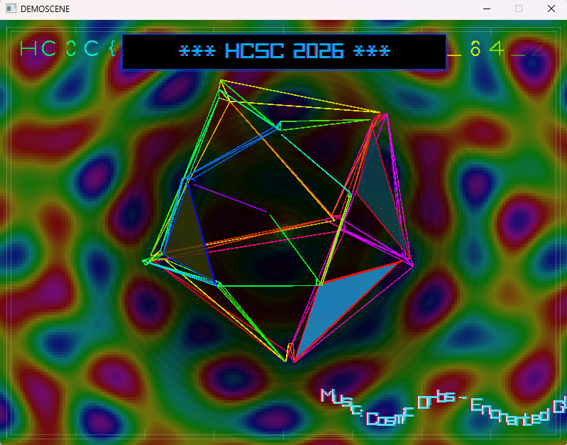
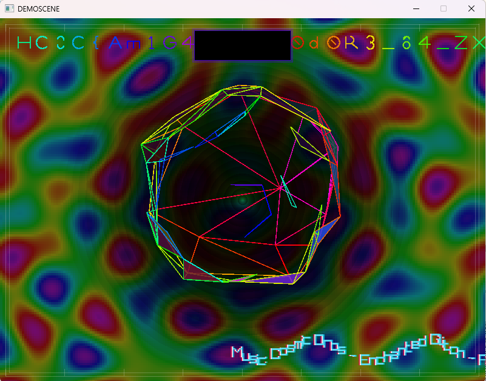
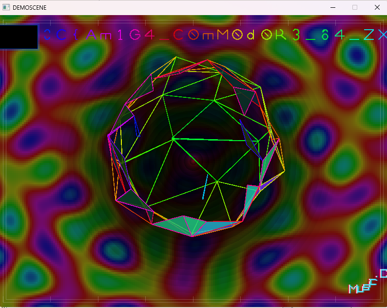
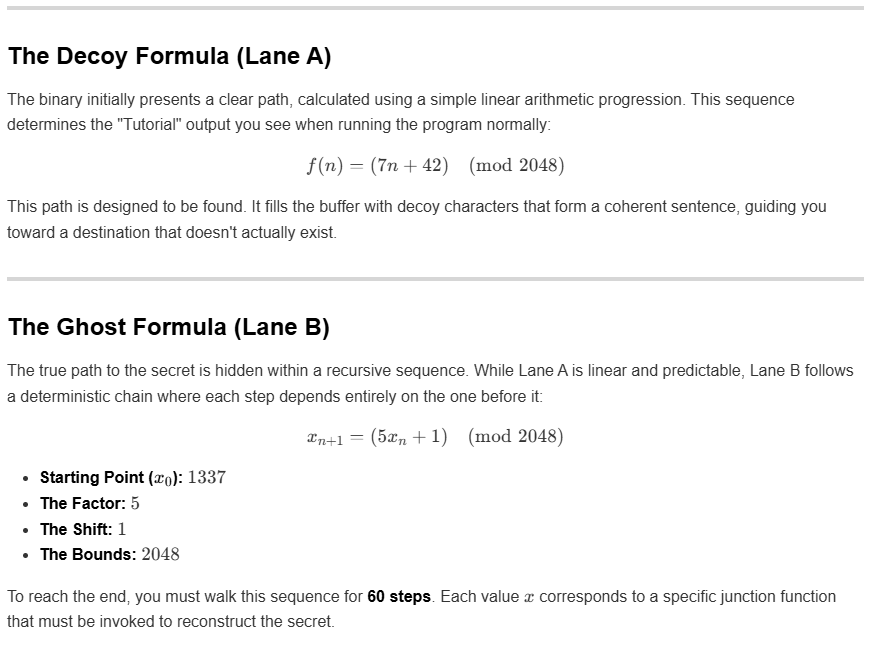
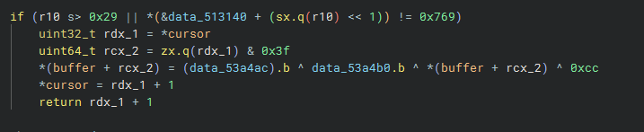

# Demoscene

**Files:** Demoscene.exe

## Solution

The Demoscene.exe is a 64 bit windows executable. Upon running it the task for this challenge becomes clear. The flag is visible in the background, but it is hidden by the text in front of it.

I tried searching for the flag string, but that did not work. I ran the executable using x64dbg. To get started I searched for the "HCSC 2026" string which I was able to find.

I tried searching for the flag string, but that did not work. I ran the executable using x64 dbg. To get started I searched for the "HCSC 2026" string which I was able to find.

Simply patching that part of the memory to be an empty string yields this result:

With a bit of trial and error I was able to find where the boxes position was being set.

After patching those values, I got this result:

Now I just needed to resize the window. To do this I found the window creation call at the start of the main function and patched it. With this version I was able to see the full flag:

